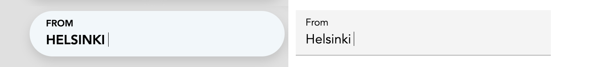
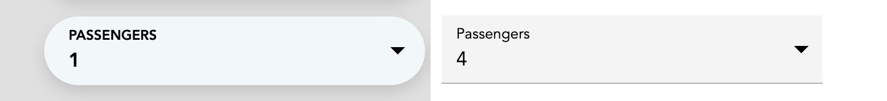
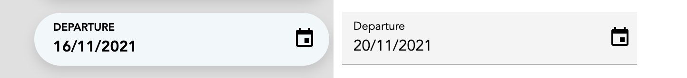

### [Voice Input](/client-libraries/voice-forms/voice-input)

Voice-enabled text field component

### [Voice Select](/client-libraries/voice-forms/voice-select)

Voice-enabled single-select dropdown component

### [Voice Toggle](/client-libraries/voice-forms/voice-toggle)

Voice-enabled single-select button group component

### [Voice Checkbox](/client-libraries/voice-forms/voice-checkbox)

Voice-enabled checkbox component

### [Voice Date Picker](/client-libraries/voice-forms/voice-date-picker)

Voice-enabled date picker component
