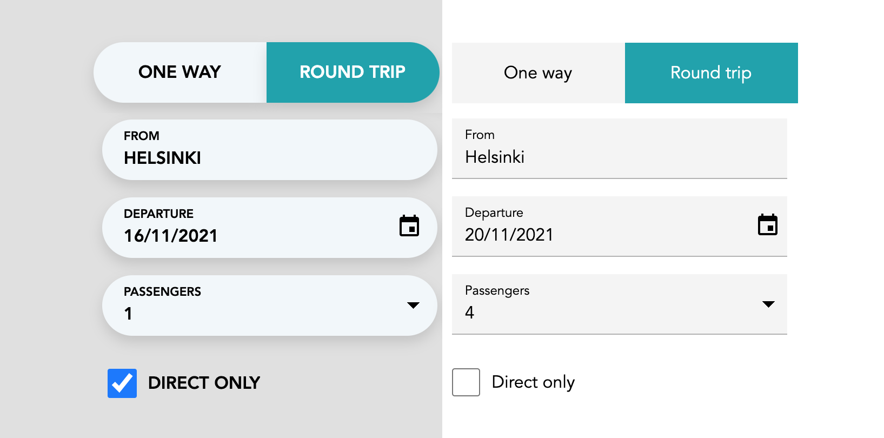

## Themes

Preview of components dressed in `capsule` and `mui` themes. To enable one of the built-in themes, include the one of the `css` files.


// Enable Material UI inspired theme
import '@speechly/react-voice-forms/css/theme/mui.css'

// OR...

// Enable Capsule theme with round widget ends
import '@speechly/react-voice-forms/css/theme/capsule.css'


## Customization

### Typography

Set typography for the input elements to define custom typography:

<code>app.css</code>

select, button, input, label {
  font-family: Helvetica, Arial, sans-serif;
  font-weight: regular;
  line-height: 120%;
}

select, input, button {
  font-size: 1.0rem;
}


### CSS variables

Some properties of the themes are exposed as `css` variables. If you override them, be sure to include your `css` file *after* the themes.

<code>app.css</code>

body {
  --color-input-bg: #f2f7fa;
  --color-input-active-bg: #00a2ad;
  --color-input-active-text: #ffffff;
  --dropdown-handle-size: 6px;
  --dropdown-handle-right-margin: 1rem;
  --widget-shadow: 0px 6px 12px 0px #00000020;
}


### Further customization

To further tweak the themes, grab the css from npm package and make a copy in your project folder.
