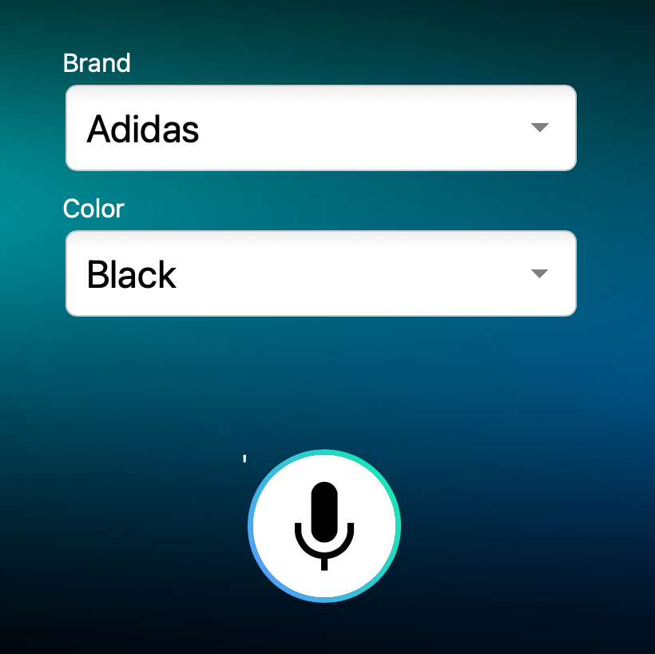
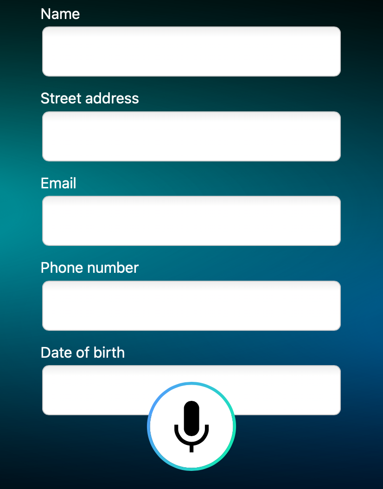

# Example applications for the Web

When creating a new application on the Speechly Dashboard, you can choose from three example configurations that each demonstrate different use-cases of Speechly on the Web.

## Ecommerce Voice FAQ

## Sneaker Shop Search Filters

<table>
<tr>
<td width="66%">

This example demonstrates the technology that underlies our Fashion demo. At the core is a regular faceted search engine, and voice is simply used to manipulate the drop-down filters.

Supports utterances such as
<ul>
<li>Blabla bla</li>
<li>Lorem ipsum</li>
<li>Foo bar</li>
</ul>

Click <a href="">here to see the configuration</a>, or click on the figure on the right to try it out in a Codepen demo.

</td>
<td></td>
</tr>
</table>

## Customer Contact Form

<table>
<tr>
<td width="66%">

Entering data into a Web form can be a daunting task, especially on a mobile device. This example shows how your users can fill out forms using their voice!

Supports utterances such as
<ul>
<li>Blabla bla</li>
<li>Lorem ipsum</li>
<li>Foo bar</li>
</ul>

Click <a href="">here to see the configuration</a>, or click on the figure on the right to try it out in a Codepen demo.

</td>
<td></td>
</tr>
</table>
