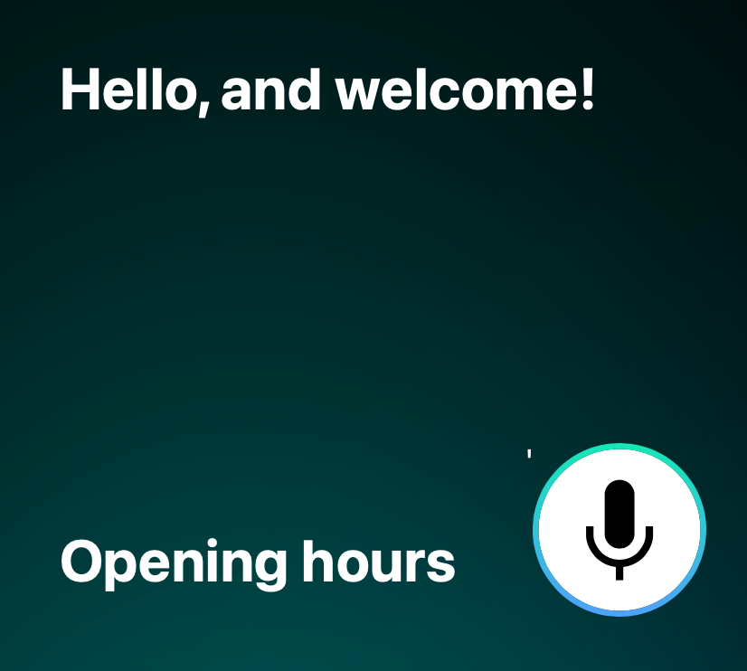

# Speech-to-text: an empty configuration
<table>
<tr>
<td>

An empty configuration provides a transcript, but no intents or entities. Use this if
<ul>
<li>you want to build your own configuration from scratch,
<li>your application only needs basic transcription capabilities,
<li>you want to try out our non-adapted speech-to-text-service.
</ul>

(Note that also speech-to-text accuracy is affected by the configuration. Especially accuracy on domain-specific vocabulary can be significantly increased by providing these as part of your configuration.)

</td>
</tr>
</table>

# Ecommerce Voice FAQ
<table>
<tr>
<td width="66%">

Finding a piece of information on a complex website can be tricky. This example demonstrates how a voice FAQ service can make your site easier to navigate.

Supports utterances such as
<ul>
<li><i>what is your email address</i></li>
<li><i>tell me about delivery options</i></li>
<li><i>i want to know about your return policy</i></li>
</ul>

Click <a href="voice-faq">here for more details</a>.

</td>
<td> <a href="https://codepen.io/aukkonen/pen/powOzor?editors=1010" target="_new">View in Codepen.</a></td>
</tr>
</table>

# Sneaker Shop Search Filters
<table>
<tr>
<td width="66%">

This example demonstrates the technology that underlies our Fashion demo. At the core is a regular faceted search engine, and voice is simply used to manipulate the drop-down filters.

Supports utterances such as
<ul>
<li><i>brand is converse</i></li>
<li><i>color is blue</i></li>
<li><i>red sneakers by new balance</i></li>
</ul>

Click <a href="search-filters">here for more details</a>.

</td>
<td> <a href="https://codepen.io/aukkonen/pen/qBjygGd?editors=1010" target="_new">View in Codepen.</a></td>
</tr>
</table>

# Customer Contact Form
<table>
<tr>
<td width="66%">

Entering data into a Web form can be a daunting task, especially on a mobile device. This example shows how to fill out forms with voice.

Supports utterances such as
<ul>
<li><i>my name is sherlock holmes</i></li>
<li><i>i live at one twenty two baker street</i>/li>
<li><i>email sherlock at gmail dot com</i></li>
</ul>

Click <a href="contact-form">here for more details</a>.

</td>
<td> <a href="https://codepen.io/aukkonen/pen/gORjbBp?editors=1010" target="_new">View in Codepen.</a></td>
</tr>
</table>
