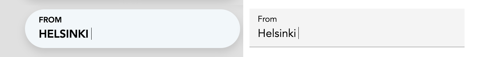

## [Voice Input](/ui-components/voice-forms/voice-input)

Voice-enabled text field component

## [Voice Select](/ui-components/voice-forms/voice-select)

Voice-enabled single-select dropdown component

## [Voice Toggle](/ui-components/voice-forms/voice-toggle)

Voice-enabled single-select button group component

## [Voice Checkbox](/ui-components/voice-forms/voice-checkbox)

Voice-enabled checkbox component

## [Voice Date Picker](/ui-components/voice-forms/voice-date-picker)

Voice-enabled date picker component
