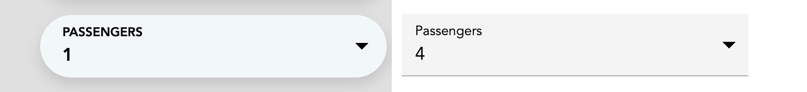

Voice Select is a voice-enabled single-select dropdown component. It changes the selection based on the _intent_, _entity type_ or _entity value_ found in the SpeechSegment.

## Preview

Voice Select dressed in `capsule` and `mui` themes. See [styling the components](../styling-the-components) for more information.

## Usage

  <button class="tablinks platform React active" onclick="openTab(event, 'platform=React')">React</button>

> You'll need a [Speechly React app](/client-libraries/usage/?platform=React) and a [Speechly configuration](/slu-examples/basics/) that tags _entities_ in phrases to use this component.

Ensure you have added the `@speechly/react-voice-forms` dependency:


npm i @speechly/react-voice-forms


Import the component and a css theme:


import { VoiceSelect } from '@speechly/react-voice-forms'
import '@speechly/react-voice-forms/css/theme/mui.css'


Place the form component somewhere inside your `SpeechProvider` block:


<SpeechProvider appId="YOUR_APP_ID_FROM_SPEECHLY_DASHBOARD">
  <VoiceSelect
    label="Cabin Class"
    options={["my_economy_id", "my_business_id"]}
    displayNames={["Economy class", "Business class"]}
    changeOnEntityType="class"
    changeOnEntityValue={["economy", "business"]}
  />
</SpeechProvider>


### Properties



